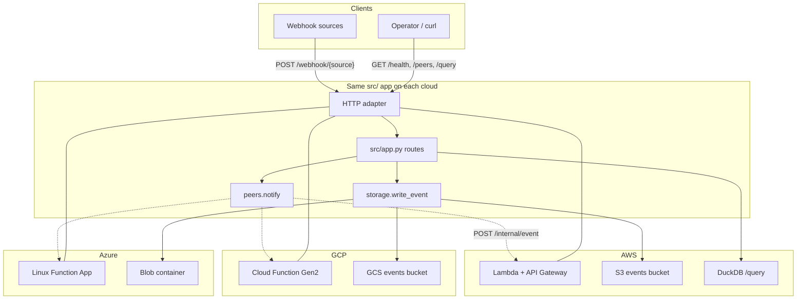

# LAMBADA

**One Python App on AWS, GCP, and Azure Serverless**

[](https://www.python.org)
[](https://www.terraform.io)
[](LICENSE)
[](https://github.com/eSlider/aws-gcp-azure/stargazers)

One Python app (`src/`), three serverless stacks (`infra/{aws,gcp,az}/`). Shared business logic ships to AWS Lambda, Google Cloud Functions, and Azure Functions with per-cloud blob storage, Terraform, and HTTP adapters.

## Use cases

| Use case | What you get |
|----------|--------------|
| **Multi-cloud portability** | Write handlers once in `src/`; swap only the thin `infra/<cloud>/python` adapter and blob facade at deploy time. |
| **Webhook ingestion** | `POST /webhook/{source}` accepts JSON payloads, wraps them in `EventRecord`, and writes hive-partitioned JSON to object storage (`events/source=…/year=…/…`). |
| **Cross-cloud fan-out** | After storing an event, each deployment notifies peer clouds at `POST /internal/event` (URLs wired by `bin/wire-peers.sh`). |
| **Serverless event lake (AWS)** | `GET /query?source=&date=` runs DuckDB over S3 JSON globs — useful for ad-hoc analytics without a warehouse. |
| **Health & discovery** | `GET /health` for probes; `GET /peers` lists configured peer base URLs for the current cloud. |
| **Reference layout** | Minimal per-cloud Terraform roots, `uv` dev tooling, credential auto-detection (`bin/load-env.sh`), and zip-based deploy artifacts in `dist/`. |

## Architecture



## API

| Method | Path | Description |
|--------|------|-------------|
| `GET` | `/health` | Liveness probe (`{"status":"ok"}`) |
| `GET` | `/peers` | Current cloud and configured peer URLs |
| `POST` | `/webhook/{source}` | Ingest JSON; store under hive path; notify peers |
| `POST` | `/internal/event` | Receive peer notification (summary JSON) |
| `GET` | `/query` | DuckDB over S3 JSON (`source`, `date` query params; AWS only) |

## Quick start

```bash
uv sync                   # dev deps (pytest) — or: bin/setup.sh
cp .env.example .env      # optional — CLI creds auto-detected
source bin/load-env.sh
bash bin/apply.sh         # build → terraform apply per cloud
bash bin/wire-peers.sh    # cross-cloud peer URLs
```

Prerequisites: [uv](https://docs.astral.sh/uv/), Terraform, and cloud CLIs (`aws`, `gcloud`, `az`) logged in. See `bin/load-env.sh` for how credentials are resolved.

## Layout

```
src/                    # business logic (cloud-agnostic)
infra/
  aws/python/           # Lambda handler, S3 blob, HTTP adapter
  aws/terraform/
  gcp/python/           # Cloud Function, GCS blob
  gcp/terraform/
  az/python/            # Azure Function, blob, host.json
  az/terraform/
dist/                   # build output (gitignored)
bin/                    # build, apply, test, env scripts
pyproject.toml          # uv project (dev deps)
AGENTS.md               # agent / maintainer notes
```

## Dev & test

```bash
uv sync
uv run pytest             # or: bin/test.sh
```

## Build & deploy

```bash
bash bin/build.sh all     # or: aws | gcp | az
```

Terraform reads `dist/<cloud>/function.zip` — run `build.sh` before `terraform apply`.

```bash
cd infra/aws/terraform && terraform init && terraform apply
cd infra/gcp/terraform && terraform apply -var="gcp_project_id=..."
cd infra/az/terraform  && terraform apply
```

Deploy status and smoke-test commands: `WORK.md`. Maintainer notes: `AGENTS.md`.

## Credentials & secrets

Nothing in this repo should contain live keys, tokens, or connection strings.

| Item | Policy |
|------|--------|
| `.env` | Local only — **gitignored**; copy from `.env.example` |
| `terraform.tfvars`, `peers.auto.tfvars.json` | **gitignored** — generated or local per environment |
| `dist/`, `*.zip`, `.terraform/`, `*.tfstate*` | **gitignored** build/state artifacts |
| Runtime secrets | Injected by Terraform (e.g. `BLOB_URI`, Azure storage connection string on the function app) |

`bin/load-env.sh` exports session credentials from `aws configure export-credentials`, `gcloud`, and `az account show` when static keys are not set in `.env`.

## GitHub metadata

```bash
bash bin/update-github-settings.sh
```

Updates repository description and topics via `gh repo edit` (pattern from [go-matrix-bot](https://github.com/eSlider/go-matrix-bot/blob/main/bot.go) env docs and [geo-spider-app](https://github.com/eSlider/geo-spider-app) settings script).
