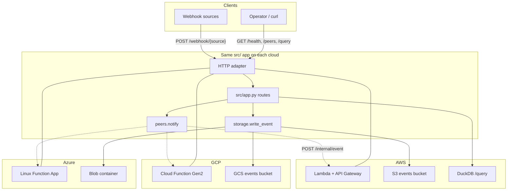

# LAMBADA

**One Python App on AWS, GCP, and Azure Serverless**

[](https://www.python.org)
[](https://www.terraform.io)
[](LICENSE)
[](https://github.com/eSlider/aws-gcp-azure/stargazers)

One Python app (`src/`), three serverless stacks (`infra/{aws,gcp,az}/`). Shared business logic ships to AWS Lambda, Google Cloud Functions, and Azure Functions with per-cloud blob storage, Terraform, and HTTP adapters.

## Use cases

| Use case | What you get |
|----------|--------------|
| **Multi-cloud portability** | Write handlers once in `src/`; swap only the thin `infra/<cloud>/python` adapter and blob facade at deploy time. |
| **Webhook ingestion** | `POST /webhook/{source}` accepts JSON payloads, wraps them in `EventRecord`, and writes hive-partitioned JSON to object storage (`events/source=…/year=…/…`). |
| **Cross-cloud fan-out** | After storing an event, each deployment notifies peer clouds at `POST /internal/event` (URLs wired by `bin/wire-peers.sh`). |
| **Serverless event lake (AWS)** | `GET /query?source=&date=` runs DuckDB over S3 JSON globs — useful for ad-hoc analytics without a warehouse. |
| **Health & discovery** | `GET /health` for probes; `GET /peers` lists configured peer base URLs for the current cloud. |
| **Reference layout** | Minimal per-cloud Terraform roots, `uv` dev tooling, credential auto-detection (`bin/load-env.sh`), and zip-based deploy artifacts in `dist/`. |

## Architecture



## API

| Method | Path | Description |
|--------|------|-------------|
| `GET` | `/health` | Liveness probe (`{"status":"ok"}`) |
| `GET` | `/peers` | Current cloud and configured peer URLs |
| `POST` | `/webhook/{source}` | Ingest JSON; store under hive path; notify peers |
| `POST` | `/internal/event` | Receive peer notification (summary JSON) |
| `GET` | `/query` | DuckDB over S3 JSON (`source`, `date` query params; AWS only) |

## Quick start

```bash
uv sync                   # dev deps (pytest) — or: bin/setup.sh
cp .env.example .env      # optional — CLI creds auto-detected
source bin/load-env.sh
bash bin/apply.sh         # build → terraform apply per cloud
bash bin/wire-peers.sh    # cross-cloud peer URLs
```

Prerequisites: [uv](https://docs.astral.sh/uv/), Terraform, and cloud CLIs (`aws`, `gcloud`, `az`) logged in. See `bin/load-env.sh` for how credentials are resolved.

## Layout

```
src/                    # business logic (cloud-agnostic)
infra/
  aws/python/           # Lambda handler, S3 blob, HTTP adapter
  aws/terraform/
  gcp/python/           # Cloud Function, GCS blob
  gcp/terraform/
  az/python/            # Azure Function, blob, host.json
  az/terraform/
dist/                   # build output (gitignored)
bin/                    # build, apply, test, env scripts
pyproject.toml          # uv project (dev deps)
AGENTS.md               # agent / maintainer notes
```

## bin/ scripts

All scripts live in `bin/` and are meant to be run from the repo root.

| Script | Purpose |
|--------|---------|
| `setup.sh` | Create/update dev venv via `uv sync` |
| `test.sh` | Run pytest (`uv run pytest`) |
| `build.sh` | Stage `src/` + cloud adapter → `dist/<cloud>/function.zip` |
| `load-env.sh` | Source `.env` and export cloud credentials for Terraform |
| `discover-env.sh` | Read-only check: which cloud accounts/CLIs are available |
| `apply.sh` | Build all clouds, then `terraform apply` per stack |
| `wire-peers.sh` | Write peer URLs to `peers.auto.tfvars.json` and re-apply |
| `destroy.sh` | `terraform destroy` for initialized cloud stacks |
| `update-github-settings.sh` | Set GitHub description and topics via `gh` |

### Typical workflow

```bash
# 1. Dev setup
bash bin/setup.sh
bash bin/test.sh

# 2. Check cloud CLIs (optional)
bash bin/discover-env.sh

# 3. Load credentials, deploy, wire peers
cp .env.example .env    # edit if needed
source bin/load-env.sh
bash bin/apply.sh
bash bin/wire-peers.sh
```

### `setup.sh`

Install dev dependencies into `.venv` (pytest, etc.).

```bash
bash bin/setup.sh
bash bin/setup.sh --group dev   # same; extra args pass through to uv
```

### `test.sh`

Run the test suite. Extra args are forwarded to pytest.

```bash
bash bin/test.sh
bash bin/test.sh tests/test_core.py -v
bash bin/test.sh -k blob
```

### `build.sh`

Rsync `src/` and `infra/<cloud>/python/` into a staging dir, zip to `dist/<cloud>/function.zip`. Azure builds also vendor Linux py3.12 wheels into the zip.

```bash
bash bin/build.sh all      # aws + gcp + az
bash bin/build.sh aws      # only AWS Lambda zip
bash bin/build.sh gcp
bash bin/build.sh az
```

Terraform reads these zips — always build before `terraform apply` if Python changed.

### `load-env.sh`

Sources `.env` (if present), sets defaults (`RESOURCE_PREFIX`, regions), and exports credentials:

- **AWS** — static keys from `.env`, or `aws configure export-credentials` when logged in
- **GCP** — `GCP_PROJECT_ID` from `.env` / gcloud; ADC path; OAuth access token for Terraform
- **Azure** — `ARM_SUBSCRIPTION_ID`, `ARM_TENANT_ID` from `az account show`

Must be **sourced**, not executed, so exports stay in your shell:

```bash
source bin/load-env.sh
echo "$AWS_REGION $GCP_PROJECT_ID $RESOURCE_PREFIX"
```

Used automatically by `apply.sh`, `wire-peers.sh`, and `destroy.sh`.

### `discover-env.sh`

Prints read-only account info from `aws`, `gcloud`, and `az` — useful before a deploy to confirm logins.

```bash
bash bin/discover-env.sh
```

No credentials are written; safe to run anytime.

### `apply.sh`

Sources `load-env.sh`, runs `build.sh all`, then `terraform init` + `terraform apply` for each cloud:

```bash
bash bin/apply.sh
```

Skips GCP when `GCP_PROJECT_ID` is unset. Passes `resource_prefix`, region/location vars from the environment.

Manual single-cloud apply (after build):

```bash
source bin/load-env.sh
cd infra/aws/terraform && terraform init && terraform apply \
  -var="resource_prefix=${RESOURCE_PREFIX}" \
  -var="aws_region=${AWS_REGION}"
```

### `wire-peers.sh`

After all clouds are deployed, reads each stack's `base_url` output, writes `infra/<cloud>/terraform/peers.auto.tfvars.json`, and re-applies so `LAMBDA_PEER_URLS` points at the other clouds.

```bash
# deploy all clouds first, then:
bash bin/wire-peers.sh
```

Enables cross-cloud `POST /internal/event` notifications when webhooks are ingested.

### `destroy.sh`

Tears down Terraform-managed resources for clouds that have been initialized (`.terraform/` exists).

```bash
bash bin/destroy.sh
```

**Warning:** destroys live infrastructure. Does not delete local `dist/` zips or `.env`.

### `update-github-settings.sh`

Updates GitHub repo description and topic tags (requires `gh auth login`).

```bash
bash bin/update-github-settings.sh
```

Deploy status and smoke-test commands: `WORK.md`. Maintainer notes: `AGENTS.md`.

## Credentials & secrets

Nothing in this repo should contain live keys, tokens, or connection strings.

| Item | Policy |
|------|--------|
| `.env` | Local only — **gitignored**; copy from `.env.example` |
| `terraform.tfvars`, `peers.auto.tfvars.json` | **gitignored** — generated or local per environment |
| `dist/`, `*.zip`, `.terraform/`, `*.tfstate*` | **gitignored** build/state artifacts |
| Runtime secrets | Injected by Terraform (e.g. `BLOB_URI`, Azure storage connection string on the function app) |

`bin/load-env.sh` exports session credentials from `aws configure export-credentials`, `gcloud`, and `az account show` when static keys are not set in `.env`. See [bin/ scripts](#bin-scripts) above.

